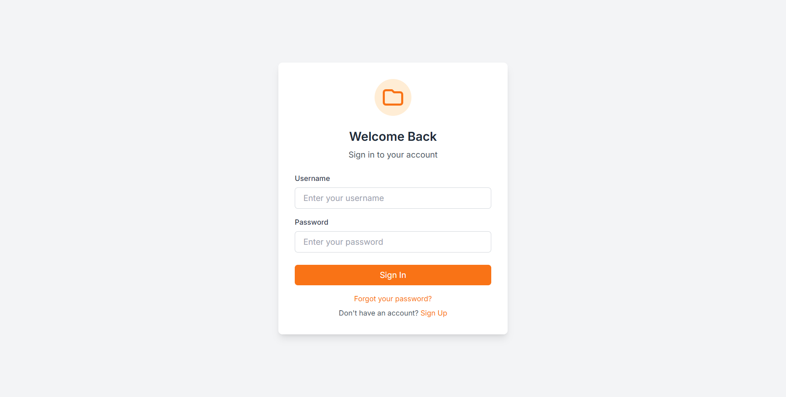
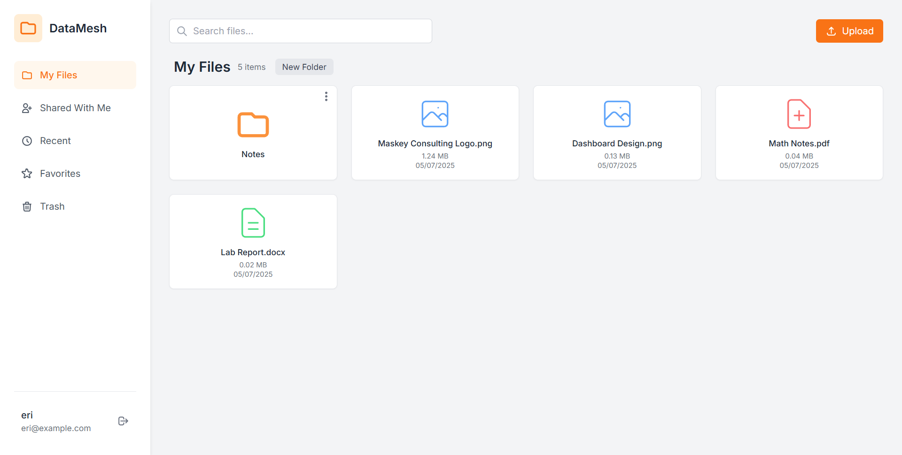
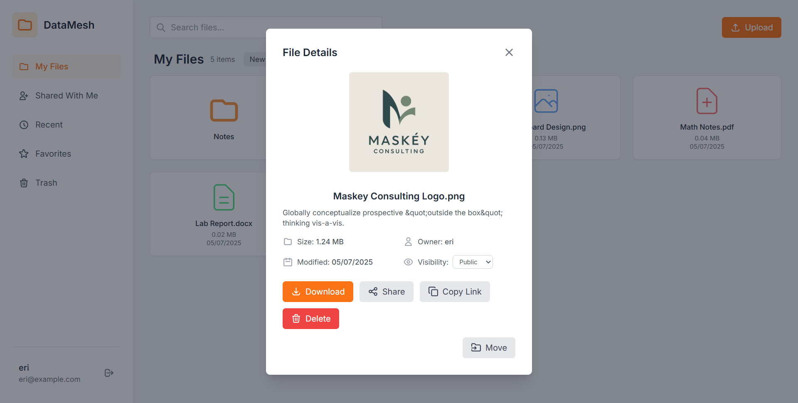
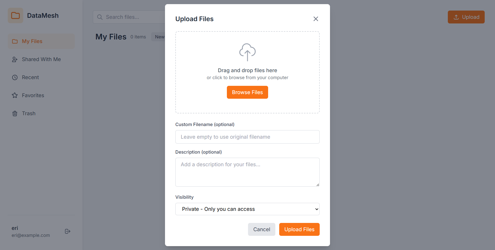

# Secure File Sharing App

A simple, secure web application built with PHP and MySQL for users to upload, store, share, and manage their documents, photos, and other files. It provides robust control over file visibility and organization, offering an intuitive experience for managing digital assets.

## Key Features

- **User Authentication:** Secure registration and login with password hashing.

- **File Uploads:** Upload files with custom names, descriptions, and initial visibility (private/public).

- **File Management:** Download, delete, and change visibility of files.

- **Folder Organization:** Create, rename, and delete folders; move files between folders.

- **File Preview:** Basic previews for images and text files.

- **Search Functionality:** Easily search for files by name, description, and type.

## Screenshots

### Login Page

### Dashboard - My Files

### File Details Modal

### Upload Modal

## Installation & Setup

1.  **Database Setup:**

    - Create a MySQL database named `file_sharing_app`.

    - Execute the SQL schema from `database.sql` to set up tables.

2.  **Project Structure:**

    - Place the project in your XAMPP `htdocs` directory (e.g., `C:\xampp\htdocs\project-datamesh`).

    - Ensure the `public/` directory is the web server's document root for this project.

3.  **Configure Apache Virtual Host (Recommended for XAMPP):**

    - Edit `C:\xampp\apache\conf\extra\httpd-vhosts.conf`.

    - Add a Virtual Host entry pointing to `C:/xampp/htdocs/project-datamesh/public` (e.g., `ServerName datamesh.local`).

    - Ensure `Include conf/extra/httpd-vhosts.conf` is uncommented in `C:\xampp\apache\conf\httpd.conf`.

    - Add `127.0.0.1 datamesh.local` to your `C:\Windows\System32\drivers\etc\hosts` file.

4.  **Install Node.js Dependencies & Build Tailwind CSS:**

    - Navigate to your project root in the terminal.

    - Install dependencies: `npm install`

    - Build Tailwind CSS for production: `npm run tailwind:build`

    - For development (watch for changes): `npm run tailwind:watch`

5.  **Update Database Credentials:**

    - Edit `app/config/database.php` with your MySQL username and password.

6.  **Restart Apache** from the XAMPP Control Panel.

## Usage

1.  Access the application via your configured domain (e.g., `http://datamesh.local/`).

2.  Register a new account.

3.  Log in to your dashboard to start uploading, organizing, and sharing files!

## Technologies Used

- **Backend:** PHP

- **Database:** MySQL

- **Frontend:** HTML5, Tailwind CSS, JavaScript
